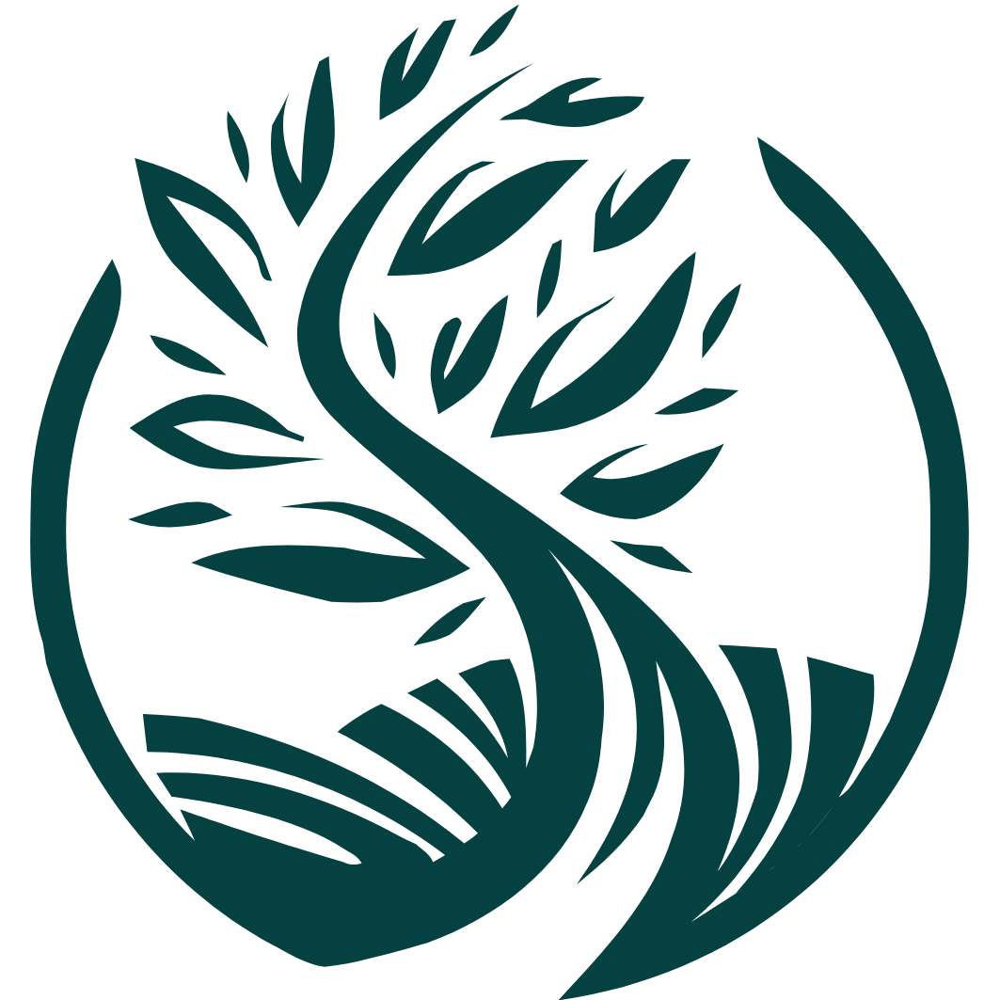

## About Culticademy

Culticademy is an online platform focused on agricultural education. Culticademy offer a wide range of educational videos and courses, covering various aspects of agriculture. From crop cultivation to sustainable farming practices, our content is designed to empower learners of all levels. Join our community today and embark on a journey of agricultural discovery. Start learning for free or explore our premium courses to enhance your knowledge and skills. Connect with like-minded individuals in our interactive forum and grow together.

## Contributors

1. Jonathan A - [@Jistoper](https://github.com/Jistoper)
2. Deny A - [@denyandriawan01](https://github.com/denyandriawan01)
3. Naufal Humam - [@nhumam123](https://github.com/nhumam123)
4. Raffi Naufal - [@RaffiN2002](https://github.com/RaffiN2002)
5. Muhammad Rizqi - [@wisp100](https://github.com/wisp100)

## Code of Conduct

This project is used for learning purposes. This project is part of a campus assignment and is under development by the culticademy group. Personal use is permitted for learning purposes. Commercial use of this source code is not permitted.

## License

The Laravel framework is open-sourced software licensed under the [MIT license](https://opensource.org/licenses/MIT).
